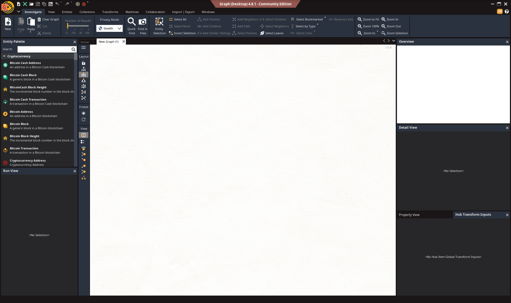
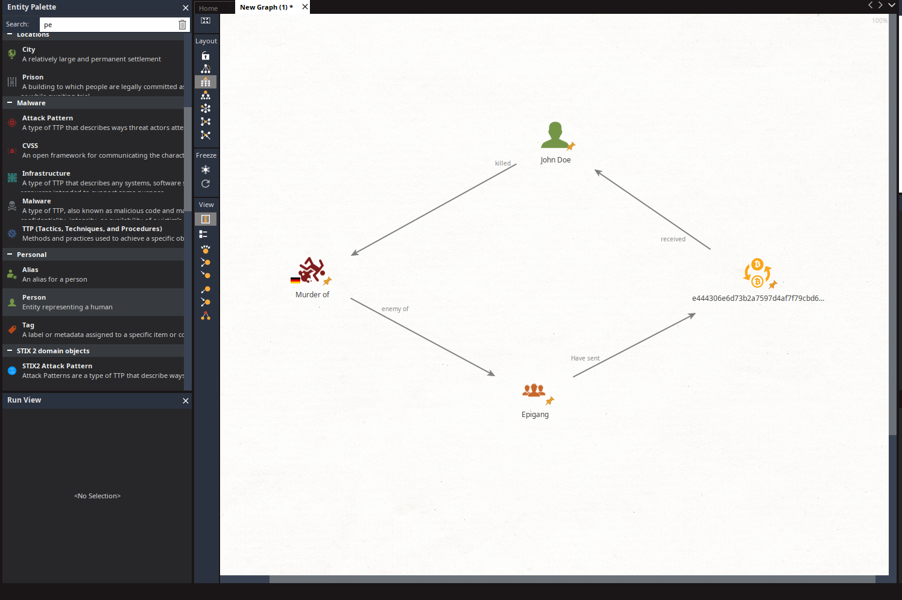

# Maltego for Malware Analysis: Beginner's Guide
Want to know how maltego works to help you with your next assignment?  
You don't know the software?  
Did you get lost on github?  
This guide is made for you  

## Table of Contents
1. [Introduction](#introduction)
2. [Why Use Maltego for Malware Analysis?](#why-use-maltego-for-malware-analysis)
3. [Setting Up Maltego](#setting-up-maltego)
4. [Key Features of Maltego for Malware Analysis](#key-features-of-maltego-for-malware-analysis)
5. [Practical Example: Analyzing a Malicious Domain](#practical-example-analyzing-a-malicious-domain)
6. [Tips and Best Practices](#tips-and-best-practices)
7. [Additional Resources](#additional-resources)

---

## Introduction
Maltego is a powerful open-source intelligence (OSINT) and data visualization tool (It's a bit like a mental map that we do at school, but for OSINT).  
It helps cybersecurity professionals connect the dots by visualizing relationships between data points, such as IPs, domains, files, and even malware samples.  
Like mental maps, this system allows you to have a quick visual of all the data available.  
This guide provides a step-by-step approach to using Maltego for malware analysis, from basic setup to performing an investigation.  

---

## Why Use Maltego for Malware Analysis?
Maltego’s graph-based interface makes it ideal for:
- **Investigating malware infrastructure** (domains, IP addresses, email addresses).
- **Mapping relationships** between malware indicators (IOCs).
- **Connecting OSINT data** to malware samples for deeper analysis.  

> [!NOTE]
> If we summarize, we can have a white board, with all our information and our proofs, to see more clearly and have better reasoning.  
> Putting all the data in one place by organizing it can make us realize things and help us find new reasoning or new avenues of investigation.  

Exemple of a map for a murder case.

---

## Setting Up Maltego

### Step 1: Install Maltego
1. Download Maltego from [Maltego's official website](https://www.maltego.com/).
2. Install the appropriate version for your OS (Windows, macOS, or Linux).
   
> [!TIP]
> For Linux users, I encourage you to search directly on the internet for "how to install maltego" accompanied by your distribution

### Step 2: Create an Account
1. Launch Maltego and sign up for a free license (community edition).
2. Log in to the Maltego client.

### Step 3: Configure Transforms
1. Install the required transforms for malware analysis:
   - **VirusTotal** (requires an API key).
   - **Shodan** (for IP and domain scans).
   - **AbuseIPDB** (for malicious IP lookups).
   - **PassiveTotal** (for domain WHOIS and DNS information).
   
---

## Key Features of Maltego for Malware Analysis

### 1. **Graph-Based Visualization**
   - Visualize relationships between malware indicators (IPs, domains, hashes).
   - Identify infrastructure shared by different malware families.

### 2. **OSINT Integration**
   - Leverage external services like VirusTotal, Shodan, and AbuseIPDB.

### 3. **Custom Entities**
   - Add custom indicators (e.g., file hashes or unique IOCs).

### 4. **Collaboration**
   - Share graphs with teammates for collaborative analysis.

---

## Practical Example: Analyzing a Malicious Domain

### Step 1: Add the Malicious Domain
1. Drag the "Domain" entity onto the graph.
2. Enter the suspected malicious domain (e.g., `example-malware.com`).

### Step 2: Run Transforms
1. Right-click the domain entity and run the following transforms:
   - **Resolve to IP**: Maps the domain to its IP address.
   - **Passive DNS Lookup**: Retrieves historical DNS data.
   - **WHOIS Lookup**: Gets ownership details of the domain.
   - **Check Reputation** (VirusTotal/AbuseIPDB): Analyzes the domain's reputation.

### Step 3: Expand the Investigation
- Explore connected entities (e.g., hosting IP, subdomains).
- Run transforms on new entities to identify additional IOCs.

### Step 4: Analyze Results
- Look for patterns such as shared infrastructure or reused domains/IPs.
- Document findings for reporting or further investigation.

> [!WARNING]
> Of course, don't use these techniques for bad intentioned purposes.  

> [!NOTE]
> If you are lost I will summarize it all a little more simply.  
> Maltego generates a cork board for you  
> You will be able to put post it notes of different types (people, building, computer, etc.)  
> You can write details inside this note  
> And then by putting several together you can connect them with a red woolen thread (like in old detective films)  
> It is then up to you, using your evidence, to make your comparisons and deductions.  

---

## Tips and Best Practices
1. **Start Small**: Begin with a single entity (e.g., a domain or IP) to avoid cluttered graphs.
2. **Use Filters**: Focus on significant connections by hiding unrelated entities.
3. **Validate Findings**: Cross-reference data with other tools (e.g., Threat Intelligence Platforms).
4. **Stay Up-to-Date**: Regularly update transforms and integrate new data sources.

---

## Additional Resources
- **Official Maltego Documentation**: [Maltego Docs](https://docs.maltego.com/)
- **Maltego Transform Hub**: Explore transforms for various use cases.
- **VirusTotal API**: [VirusTotal](https://www.virustotal.com/)
- **Shodan API**: [Shodan](https://www.shodan.io/)
- **AbuseIPDB**: [AbuseIPDB](https://www.abuseipdb.com/)
- **OSINT: Maltego Beginner Get Started Tutorial**: [Maltego4Begginers](https://www.youtube.com/watch?v=kmOIhvsklv8)
- **Maltego - The Automated OSINT Tool for Ethical Hackers**: [Auto4begginers](https://www.youtube.com/watch?v=a2ZvpwF3u-M)

> [!TIP]
> As you learn at Epitech. Google is your friend, this guide is not yet very complete and will probably never be the best  
> So don't hesitate to ask your Google friend, he will also be happy to help you  

---

Happy investigating! ^^  
Alex  
