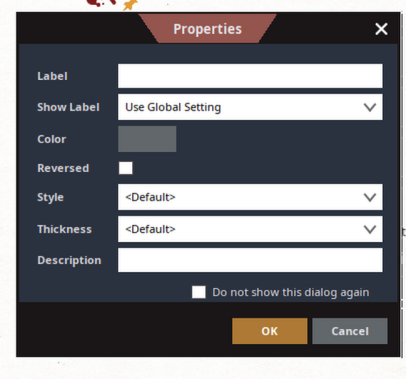
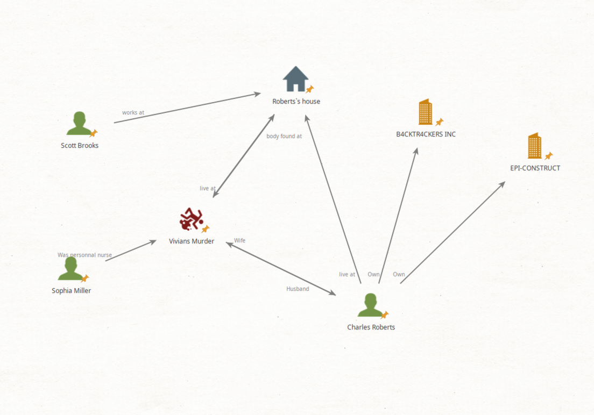
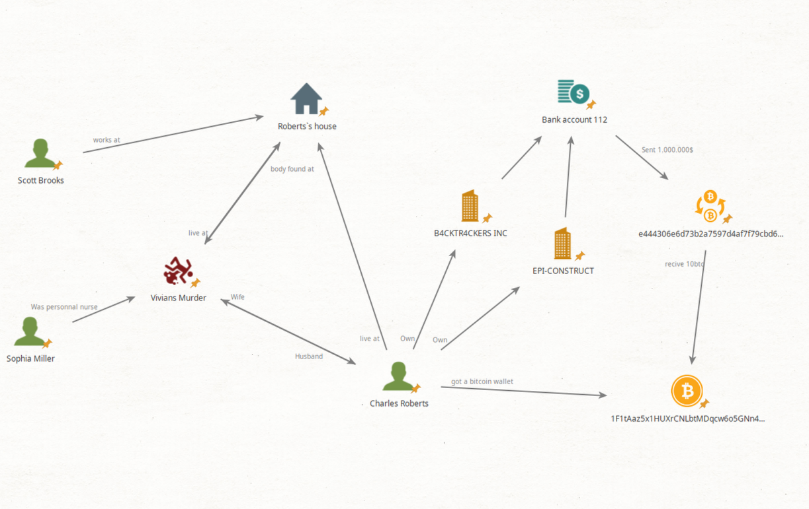
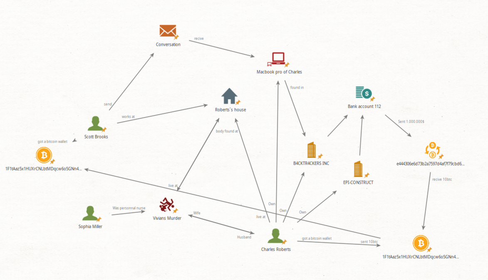
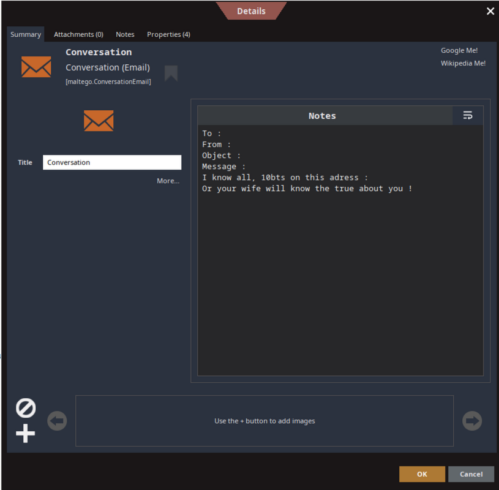
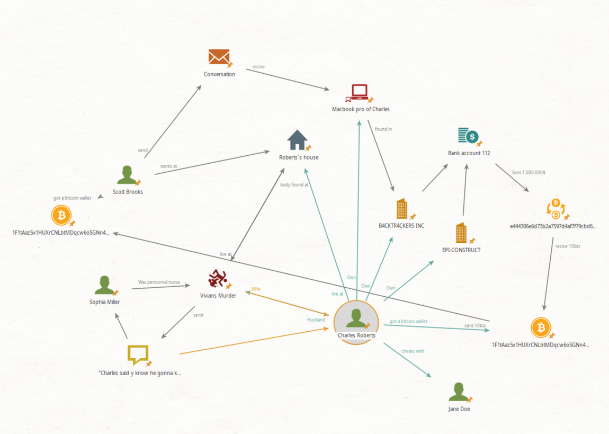

# 📖💻 Maltego: The Ultimate Detective's Guide 💻📖
Ever wondered how to become a digital Sherlock Holmes? 🕵️‍♂️🔍  
Curious about how Maltego can be your trusty magnifying glass in the world of data?  
Lost in the vast sea of GitHub repositories? 🌊  
This guide is your treasure map to mastering Maltego! 🗺️🏴‍☠️  

## Table of Contents
1. [Introduction](#introduction)
2. [Why Maltego](#why-maltego-)
3. [Why Use Maltego ?](#why-use-maltego-)
4. [Setting Up Maltego](#setting-up-maltego)
6. [Practical Example: Viviane Roberts Murder Case :](#practical-example-viviane-roberts-murder-case-)
7. [Tips and Best Practices](#tips-and-best-practices)
8. [Additional Resources](#additional-resources)

---

## Introduction
Maltego is a powerful open-source intelligence (OSINT) and data visualization tool. Think of it as a digital version of the mental maps we used to create in school, but for OSINT. 🧠  
It helps cybersecurity professionals, police agent 👮 and so on to visualizing relationships between data points, such as IPs, domains, files, and even malware samples.  
This tinny system provides a quick visual overview of all available data, making it easier to identify patterns and connections.  
This guide offers a step-by-step approach to using Maltego and explains why it's an excellent tool for malware analysis.  

---

## Why Maltego ❓
To complete what was said above, and to summarize and give concrete examples.  
Maltego is the equivalent of the cork board with all the evidence from the old detective series  
(The famous cork board with red threads connecting all the evidence together)  
It is a visual way of collecting 💡clues💡 about a specific situation.
 
Some usage of Maltego is :
- Tracking Criminals 🦹 : View connections between email addresses, phones, and online profiles to identify suspects or organized groups.
- Fraud analysis 💸💸: Examine financial transfers, fake accounts or fictitious organizations.
- Cyberattack tracking 🖥️: Identify where an attack is coming from by connecting digital clues (like IP addresses and servers).
- Investigative Research 🔬: Collect and organize information for investigative reporting (e.g. Pandora Papers).
- Finding information about individuals 👨: Find email addresses, social media profiles, phone numbers, or associations with organizations.  

Some famous exemples :
- During investigations into malicious infrastructure linked to attacks like Emotet, Maltego has been used to map associated domains, servers and IP addresses, allowing the location of command and control (C&C) servers.
- Maltego has been included in investigations by Interpol and other agencies to detect terrorist organizations' financing networks or their online communications.
- Journalists investigating the misuse of Pegasus spyware (by governments to target journalists, activists, and politicians) used Maltego to visualize and understand the connections between targeted phone numbers and the organizations involved.
 
Maltego is also used by police force worldwide 👮 :  
- Interpol 🌠 
- Cyber Police 🇺🇦  
- Federal Bureau of Investigations 🇺🇸  

## Why Use Maltego ❓
Maltego is a versatile tool that can be used for various purposes, including:

- **Data Visualization**: Create visual representations of complex data sets to identify patterns and relationships.
- **Open-Source Intelligence (OSINT)**: Gather and analyze publicly available information for investigative purposes.
- **Cybersecurity**: Track and analyze cyber threats, including malware, phishing, and other malicious activities.
- **Investigative Research**: Collect and organize information for journalism, academic research, or legal investigations.
- **Network Analysis**: Map and analyze network structures, including social networks, communication networks, and organizational hierarchies.

Maltego’s graph-based interface makes it easy to connect the dots and uncover hidden connections in your data.

Exemple of a map for a murder case 🗡️.

---

## Setting Up Maltego

### Step 1: Install Maltego
1. Download Maltego from [Maltego's official website](https://www.maltego.com/).
2. Install the appropriate version for your OS (Windows, macOS, or Linux).
   
> [!TIP]
> For Linux users, I encourage you to search directly on the internet for "how to install maltego" accompanied by your distribution

### Step 2: Create an Account
1. Launch Maltego and sign up for a free license (community edition, the only one you can use at least u wana pay 8k).
2. Log in to the Maltego client (just follow the instructions).
3. You are ready to go !

> [!TIP]
> If one day maltego refuses to log you and assign you a license  
> delete your account files (MaltegoID.activation and MaltegoID.keypair)  
> on ~/.maltego/  
   
---

## Practical Example: Viviane Roberts Murder Case :
Vivian Roberts was murdered in 2019, her body discovered outside her mansion.  
The case was closed after her death was attributed to an unsolved burglary, but rumors suggest otherwise.  

### First, put all family members on the board
  
Using the left bar, we can search for "incident", and "pepole"  
It will really be usefull for our case.  
Once placed you can by clicking on the name "murdrer" of the card, you can change its name to Vivians murder.  
We can do the same thing for all the cards. Let's also name the main protagonists of our story.  
  
By clicking several times, you can add notes inside the card.  
  

### Now, lets find some links !
If you click on a map and keep your left click pressed you can see that you are drawing an arrow,  
useful for showing connections between people. You can also edit their names there  
  
and see the result  
  

### Now, lets find some new clues !
By searching the internet, we can see that the husband owns 2 businesses, let's put them on the graph!  
  
Let's call Dectective Maellie, and Mathis   !  
They find new evidence in this case !  
  
Now we know (and we can see) that the companies are on the same bank account,  
And that Charles has a BTC wallet. We also know a $ ==> BTC transfer was made  
from the company accounts to Charles' personal wallet  

### What next ?
We can now see that Charles is suspicious.  
Our team can now investigate more on Charles, and the companies.  
  
Now we know that Charles has been blackmailled by Scott  
  
Scott know something about Charles and Vivian,  
We can now investigate more on Scott, and the relation between Charles and Vivian  

### 🔚The end🔚
  
After a long investigation, we can now see that Charles  
was the one who killed Vivian, there is loot of proof  
that we can see on the map. (the color lines can help to see links)  
Now you can give the board to everyone, and they can see and understand the case  

### 🎇Conclusion🎇
This is a simple example of how Maltego can be used to visualize and analyze complex relationships between entities.  
By connecting the dots and uncovering hidden connections, you can gain valuable insights and solve mysteries.  

---

## Tips and Best Practices
1. **Start Small**: Begin with a single entity (e.g., a domain or IP) to avoid cluttered graphs.
2. **Use Filters**: Focus on significant connections by hiding unrelated entities.
3. **Validate Findings**: Cross-reference data with other tools (e.g., Threat Intelligence Platforms).
4. **Stay Up-to-Date**: Regularly update transforms and integrate new data sources.

---

## Additional Resources
- **Official Maltego Documentation**: [Maltego Docs](https://docs.maltego.com/)
- **Maltego Transform Hub**: [Transform Hub](https://www.maltego.com/transform-hub/)
- **VirusTotal API**: [VirusTotal](https://www.virustotal.com/)
- **Shodan API**: [Shodan](https://www.shodan.io/)
- **AbuseIPDB**: [AbuseIPDB](https://www.abuseipdb.com/)
- **OSINT: Maltego Beginner Get Started Tutorial**: [Maltego4Begginers](https://www.youtube.com/watch?v=kmOIhvsklv8)
- **Maltego - The Automated OSINT Tool for Ethical Hackers**: [Auto4begginers](https://www.youtube.com/watch?v=a2ZvpwF3u-M)
- **Maltego - Maltego FAQ** : [Maltego-FAQ](https://www.maltego.com/maltego-faq/)

---

Happy investigating! ^^  
Alex  
---
B4CKTR4CKERS -- 2024
